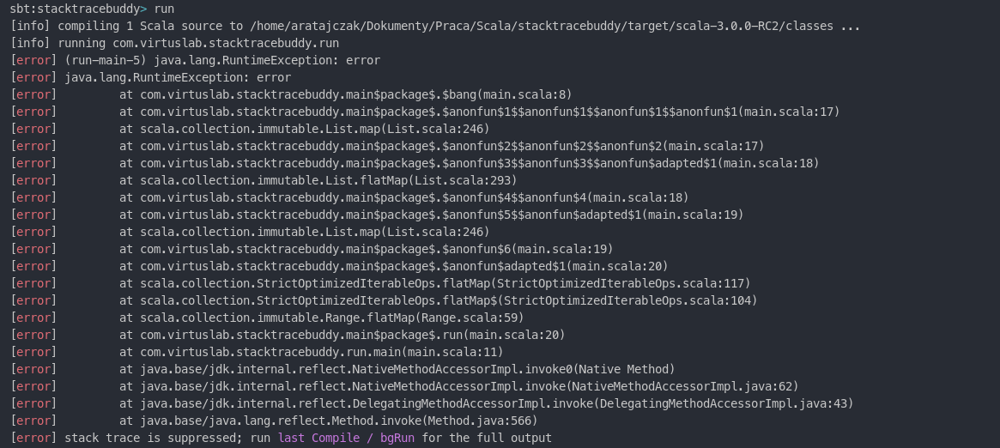
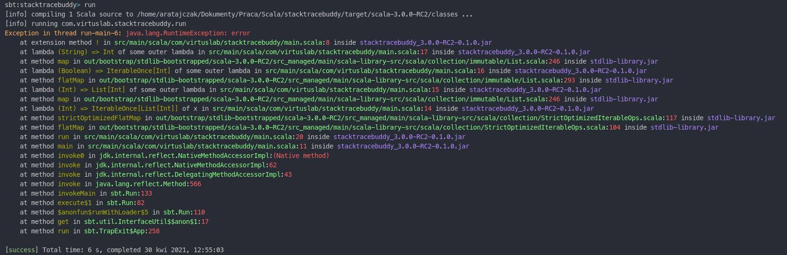
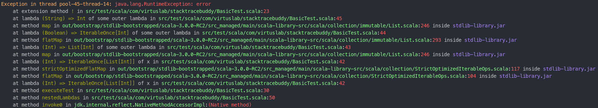

# Pretty stacktraces

### Goal

The intention of this tool is to provide simpler debugging for Scala novices. It prettifies standard bytecode stacktrace by removing garbage,
resolving name mangling and applying colors for better UX.

### Example

Let's assume the following code:

```scala
extension (n: Int)
  def !(n2: Int): Int =
    if math.random < n/10.0 then throw RuntimeException("error")
    n + n2

@main def run() =
  val x = (0 to 10).flatMap { 
    n => List(n).map { 
      n => (if n > 5 then List(true) else List(false)).flatMap {
        n => (if n then List("0") else List("5")).map { 
          n => n.toInt ! n.toInt ! n.toInt 
        }
      }
    } 
  }
```

After executing it with `sbt run` we get following output:

<details>
  <summary>Standard stacktrace</summary>
  
  ```
sbt:pretty-stacktraces> run
[info] compiling 1 Scala source to <root>/stacktraces/target/scala-3.0.0-RC2/classes ...
[info] running org.virtuslab.stacktraces.run 
[error] (run-main-5) java.lang.RuntimeException: error
[error] java.lang.RuntimeException: error
[error]         at org.virtuslab.stacktraces.main$package$.$bang(main.scala:8)
[error]         at org.virtuslab.stacktraces.main$package$.$anonfun$1$$anonfun$1$$anonfun$1$$anonfun$1(main.scala:17)
[error]         at scala.collection.immutable.List.map(List.scala:246)
[error]         at org.virtuslab.stacktraces.main$package$.$anonfun$2$$anonfun$2$$anonfun$2(main.scala:17)
[error]         at org.virtuslab.stacktraces.main$package$.$anonfun$3$$anonfun$3$$anonfun$adapted$1(main.scala:18)
[error]         at scala.collection.immutable.List.flatMap(List.scala:293)
[error]         at org.virtuslab.stacktraces.main$package$.$anonfun$4$$anonfun$4(main.scala:18)
[error]         at org.virtuslab.stacktraces.main$package$.$anonfun$5$$anonfun$adapted$1(main.scala:19)
[error]         at scala.collection.immutable.List.map(List.scala:246)
[error]         at org.virtuslab.stacktraces.main$package$.$anonfun$6(main.scala:19)
[error]         at org.virtuslab.stacktraces.main$package$.$anonfun$adapted$1(main.scala:20)
[error]         at scala.collection.StrictOptimizedIterableOps.flatMap(StrictOptimizedIterableOps.scala:117)
[error]         at scala.collection.StrictOptimizedIterableOps.flatMap$(StrictOptimizedIterableOps.scala:104)
[error]         at scala.collection.immutable.Range.flatMap(Range.scala:59)
[error]         at org.virtuslab.stacktraces.main$package$.run(main.scala:20)
[error]         at org.virtuslab.stacktraces.run.main(main.scala:11)
[error]         at java.base/jdk.internal.reflect.NativeMethodAccessorImpl.invoke0(Native Method)
[error]         at java.base/jdk.internal.reflect.NativeMethodAccessorImpl.invoke(NativeMethodAccessorImpl.java:62)
[error]         at java.base/jdk.internal.reflect.DelegatingMethodAccessorImpl.invoke(DelegatingMethodAccessorImpl.java:43)
[error]         at java.base/java.lang.reflect.Method.invoke(Method.java:566)
[error] stack trace is suppressed; run last Compile / bgRun for the full output
[error] Nonzero exit code: 1
[error] (Compile / run) Nonzero exit code: 1
[error] Total time: 1 s, completed 30 kwi 2021, 12:51:27
  ```

</details>



As you can see the stacktrace has a lot of internal bytecode calls which does not resemble Scala code:
- name `!` is translated to `$bang`
- lambdas has synthetic names like `$anonfun$1$$anonfun$1$$anonfun$1$$anonfun$1`
- synthetic functions which don't have source code conterparts like `$anonfun$3$$anonfun$3$$anonfun$adapted$1`
- another name mangling for `@inline def strictOptimizedFlatMap` in file `StrictOptimizedIterableOps.scala:117` renamed to `flatMap`

This is where stacktraces comes in. Let's try wrap our example inside this try catch:

```scala
  try
    // code that throws an exception
    ...
  catch
    case e: Exception =>
      val prettyStackTrace = stacktraces.convertToPrettyStackTrace(e)
      PrettyExceptionPrinter.printStacktrace(prettyStackTrace)
```

After executing it with `sbt run` we get following output:

<details>
  <summary>Prettified stacktrace</summary>
  
  ```
sbt:stacktraces> run
[info] compiling 1 Scala source to <root>/stacktraces/target/scala-3.0.0-RC2/classes ...
[info] running org.virtuslab.stacktraces.run 
Exception in thread run-main-6: java.lang.RuntimeException: error
    at extension method ! in src/main/scala/com/virtuslab/stacktraces/main.scala:8 inside stacktraces_3.0.0-RC2-0.1.0.jar
    at lambda (String) => Int of some outer lambda in src/main/scala/com/virtuslab/stacktraces/main.scala:17 inside stacktraces_3.0.0-RC2-0.1.0.jar
    at method map in out/bootstrap/stdlib-bootstrapped/scala-3.0.0-RC2/src_managed/main/scala-library-src/scala/collection/immutable/List.scala:246 inside stdlib-library.jar
    at lambda (Boolean) => IterableOnce[Int] of some outer lambda in src/main/scala/com/virtuslab/stacktraces/main.scala:16 inside stacktraces_3.0.0-RC2-0.1.0.jar
    at method flatMap in out/bootstrap/stdlib-bootstrapped/scala-3.0.0-RC2/src_managed/main/scala-library-src/scala/collection/immutable/List.scala:293 inside stdlib-library.jar
    at lambda (Int) => List[Int] of some outer lambda in src/main/scala/com/virtuslab/stacktraces/main.scala:15 inside stacktraces_3.0.0-RC2-0.1.0.jar
    at method map in out/bootstrap/stdlib-bootstrapped/scala-3.0.0-RC2/src_managed/main/scala-library-src/scala/collection/immutable/List.scala:246 inside stdlib-library.jar
    at lambda (Int) => IterableOnce[List[Int]] of x in src/main/scala/com/virtuslab/stacktraces/main.scala:14 inside stacktraces_3.0.0-RC2-0.1.0.jar
    at method strictOptimizedFlatMap in out/bootstrap/stdlib-bootstrapped/scala-3.0.0-RC2/src_managed/main/scala-library-src/scala/collection/StrictOptimizedIterableOps.scala:117 inside stdlib-library.jar
    at method flatMap in out/bootstrap/stdlib-bootstrapped/scala-3.0.0-RC2/src_managed/main/scala-library-src/scala/collection/StrictOptimizedIterableOps.scala:104 inside stdlib-library.jar
    at method run in src/main/scala/com/virtuslab/stacktraces/main.scala:20 inside stacktraces_3.0.0-RC2-0.1.0.jar
    at method main in src/main/scala/com/virtuslab/stacktraces/main.scala:11 inside stacktraces_3.0.0-RC2-0.1.0.jar
    at method invoke0 in jdk.internal.reflect.NativeMethodAccessorImpl:(Native method) 
    at method invoke in jdk.internal.reflect.NativeMethodAccessorImpl:62 
    at method invoke in jdk.internal.reflect.DelegatingMethodAccessorImpl:43 
    at method invoke in java.lang.reflect.Method:566 
    at method invokeMain in sbt.Run:133 
    at method execute$1 in sbt.Run:82 
    at method $anonfun$runWithLoader$5 in sbt.Run:110 
    at method get in sbt.util.InterfaceUtil$$anon$1:17 
    at method run in sbt.TrapExit$App:258 

[success] Total time: 6 s, completed 30 kwi 2021, 12:55:0
  ```

</details>



Advantages of that solution:
- unmangles names to the ones from the source code
- instead of providing umeaningful name like `$anonfun$1$$anonfun$1$$anonfun$1$$anonfun$1` tries provide some context information, e. g. type of that lambda
- tries to filter synthetic calls that are not crucial to follow the exection trace, e. g. `$anonfun$3$$anonfun$3$$anonfun$adapted$1`
- add ANSI coloring to the output, so it is readable for the end-user

### How does it work?

This is example is just proof of concept, for now tool is working heuristically since a lot of semantic information is lost during compilation.
The idea is simple, since the stacktrace already has well definded file/line data for source code, we try to find the corresponding TASTY file,
then we traverse the file to find `DefDef` defined in that line.

### Shortcomings of that solution

The general problem is for nested functions with mangled names. Let's look at the below example, which can be found at [test](./src/test/scala/com/virtuslab/stacktraces/BasicTest.scala) directory.

```scala
private def executeTest(test: () => Unit) =
    try
      test()
    catch
      case e: Exception =>
        val prettyStackTrace = stacktraces.convertToPrettyStackTrace(e)
        PrettyExceptionPrinter.printStacktrace(prettyStackTrace)

  @Test 
  def nestedLambdas = executeTest { () =>
      val y = 1
      val x = (0 to 10).flatMap { 
        n => List(n).map { 
          n => (if n > 5 then List(true) else List(false)).flatMap {
            n => (if n then List("0") else List("5")).map { 
              n => n.toInt ! n.toInt ! n.toInt 
            }
          }
        } 
      }
      val z = 1
    } 
```

If we take a look at the prettified stacktrace, we get:



the first lambda counting from the bottom of the stack trace is:

```
at lambda (Int) => IterableOnce[List[Int]] of x in src/test/scala/com/virtuslab/stacktraces/BasicTest.scala:42
```

which should actually be

```
at lambda () => Unit of executeTest in src/test/scala/com/virtuslab/stacktraces/BasicTest.scala:37
```

The problem is, the original stack trace for that is:

```
...
org.virtuslab.stacktraces.BasicTest.$anonfun$6(BasicTest.scala:47)
org.virtuslab.stacktraces.BasicTest.$anonfun$adapted$1(BasicTest.scala:48) // <-- pointing at closing bracket of flatMap
scala.collection.StrictOptimizedIterableOps.flatMap(StrictOptimizedIterableOps.scala:117)
scala.collection.StrictOptimizedIterableOps.flatMap$(StrictOptimizedIterableOps.scala:104)
scala.collection.immutable.Range.flatMap(Range.scala:59)
org.virtuslab.stacktraces.BasicTest.nestedLambdas$$anonfun$1(BasicTest.scala:48) // <-- also pointing at closing bracket of flatMap
org.virtuslab.stacktraces.BasicTest.executeTest(BasicTest.scala:30)
org.virtuslab.stacktraces.BasicTest.nestedLambdas(BasicTest.scala:50)
...
```

We could try to use the name `nestedLambdas$$anonfun$1` for further disambiguation, but it's not general rule that lamba will have prefix of its wrapping function, eventually
we always can end up with some hard to disambiguate problem.

### Further development

We should consider generating some metadata for debugging purposes.
